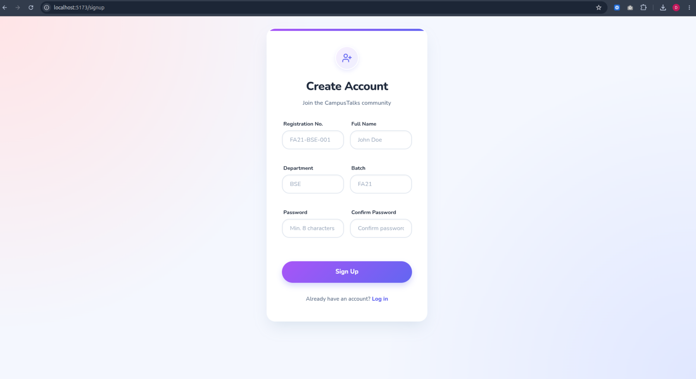
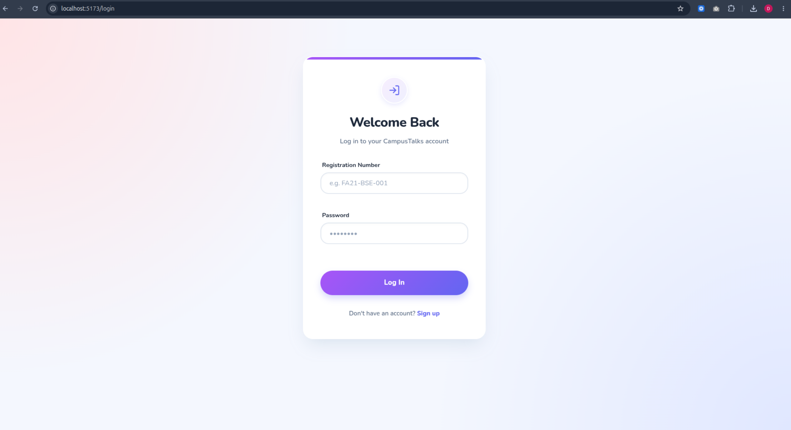
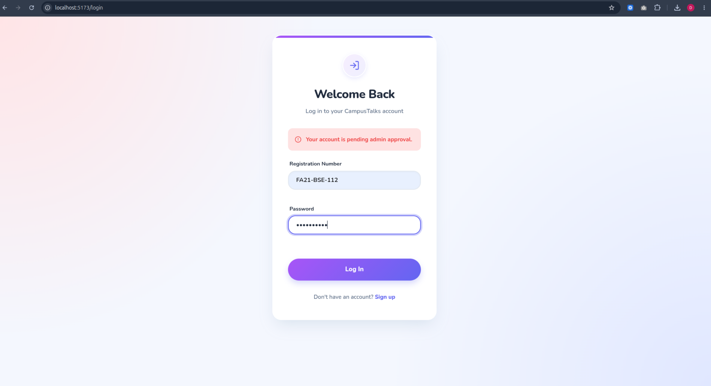
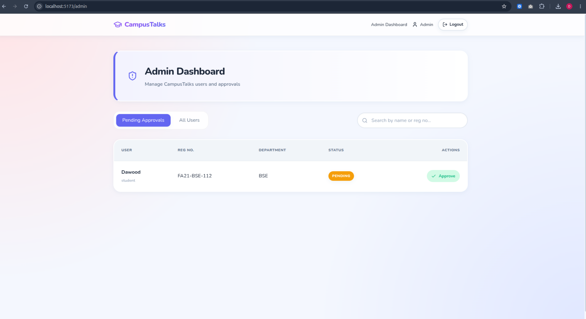
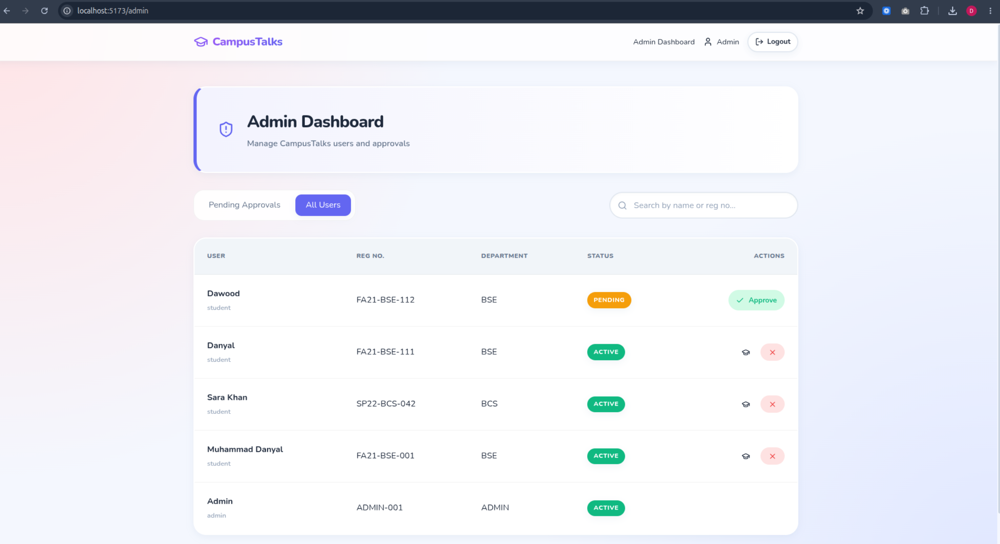
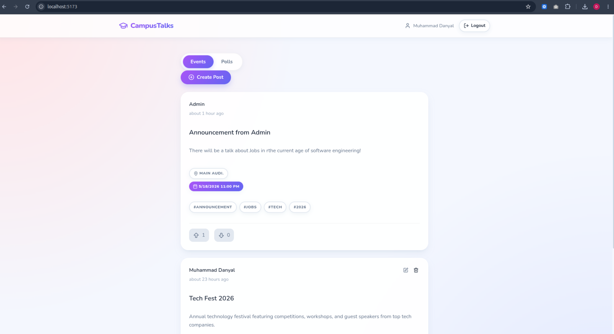
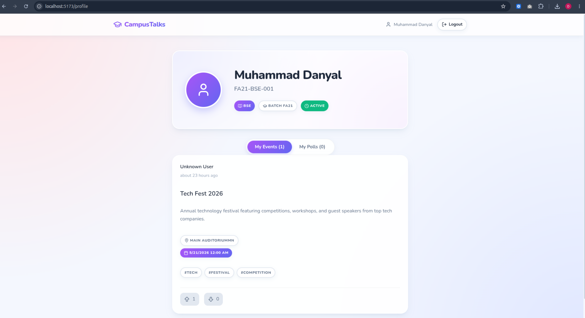

# CampusTalks

A platform where **verified university students** create events, run polls, and engage with their community. No outsiders. Admin-gated access only.

> Built with MERN Stack · JWT Auth · RBAC · SaaS-ready

---

## Screenshots

### Register Page


### Login Page


### Pending Registration Error


### Admin Dashboard


### Manage Users


### Feed Page


### Profile Page


---

## Features

**Students**
- Sign up with university registration number (e.g. `FA21-BSE-001`)
- Create, edit, and delete their own events and polls
- Upvote / downvote events · Vote on polls with live progress bars
- Personal dashboard showing their posts, stats, and active polls

**Admins**
- Approve or decline student signups
- Suspend students or mark them as graduated (session revoked instantly)
- Force-delete any event or poll
- Filter and manage all users

---

## Tech Stack

| | |
|---|---|
| **Frontend** | React 18 + Vite, React Router v6, Axios, react-hot-toast, lucide-react |
| **Backend** | Node.js, Express.js |
| **Database** | MongoDB + Mongoose |
| **Auth** | JWT (access + refresh), bcryptjs |
| **Validation** | Zod (frontend + backend) |
| **Security** | helmet, cors, express-rate-limit |

---

## Setup

**Prerequisites:** Node.js 18+, MongoDB

```bash
# Backend
cd backend
npm install
node scripts/seedAdmin.js   # creates first admin account
cp .env.example .env        # fill in MONGO_URI + JWT secrets
npm run dev                 # → http://localhost:5000

# Frontend
cd frontend
npm install
npm run dev                 # → http://localhost:5173
```

**Required env vars:**
```env
MONGO_URI=mongodb://localhost:27017/campustalks
JWT_ACCESS_SECRET=
JWT_REFRESH_SECRET=
CLIENT_URL=http://localhost:5173
```

---

## Roles & Permissions

| | Student | Admin |
|---|:---:|:---:|
| Create event / poll | ✅ | ✅ |
| Edit / delete own posts | ✅ | ✅ |
| Delete any post | ❌ | ✅ |
| Upvote / downvote / vote on polls | ✅ | ✅ |
| Approve / reject signups | ❌ | ✅ |
| Suspend/Unsuspend or graduate a student | ❌ | ✅ |
| View all users | ❌ | ✅ |

---

## Security

- **Outsiders blocked** — reg number format validated by regex; unrecognized departments rejected at signup
- **No auto-access** — every signup is `pending` until an admin manually approves it
- **Real logout** — refresh token nulled in DB on logout, reuse rejected server-side
- **Instant revocation** — session invalidated immediately when a student is suspended or graduated
- **No reg number clashes** — partial unique index allows the same number across graduated and active users
- **Rate limiting** — 200 requests / 15 min on all auth routes


Built by [Danyal](https://linkedin.com/in/danyal-dev) — a self-taught developer from Islamabad, Pakistan.